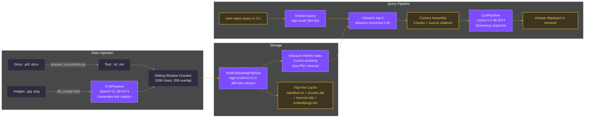
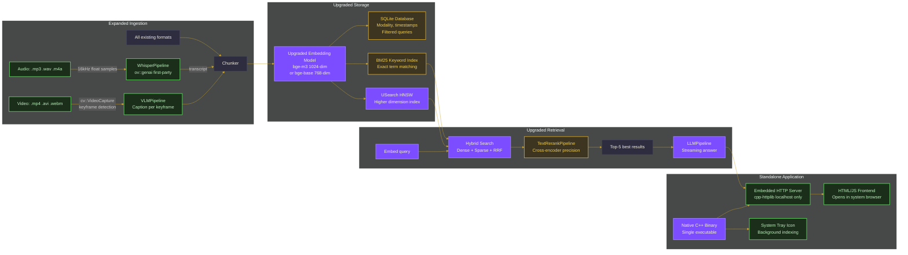
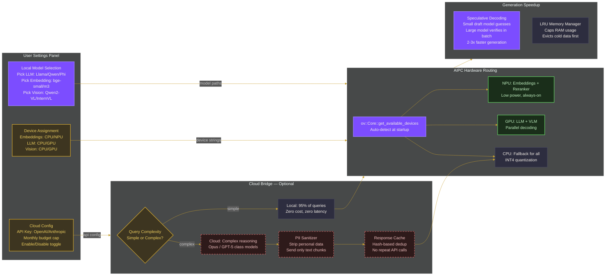

# OvaSearch Architecture

## Flowchart 1 — Current State: How OvaSearch Works Today



**What each component does:**

| Component | Role | Code Reference |
|-----------|------|---------------|
| TextEmbeddingPipeline | Converts text to 384-dim vectors | main.cpp L688 |
| VLMPipeline | Describes images as text captions | main.cpp L695, L127-146 |
| LLMPipeline | Generates answers from context | main.cpp L703, L907-910 |
| USearch HNSW | Finds nearest vectors by cosine | main.cpp L680-683 |
| Flat-File Cache | Stores chunks/embeddings on disk | main.cpp L166-258 |
| Sliding Window | Splits text into overlapping chunks | main.cpp L148-164 |

**Limitations of current state:**
- CLI only, no GUI
- All models hardcoded to CPU
- No video or audio support
- No keyword search, pure semantic only
- Flat-file cache has no filtering or metadata

---

## Flowchart 2 — Phase 1-2: Local Application Upgrades



**Key upgrades over current state:**

| Upgrade | Why | Swappable? |
|---------|-----|-----------|
| SQLite replaces flat files | Filtered queries, metadata, modality tagging | Config: database path |
| BM25 added alongside vectors | Catches exact IDs, names, codes that vectors miss | Config: enable/disable |
| TextRerankPipeline | 47% fewer retrieval failures via precise scoring | Config: reranker model path |
| WhisperPipeline | Audio transcription, first-party OpenVINO API | Config: whisper model path |
| Video keyframes | Scene detection + VLM caption per frame | Config: enable/disable |
| Embedding upgrade | Better vectors = better everything downstream | Config: model path + dimension |
| Standalone app with embedded server | Runs as single binary, opens browser tab on localhost | Always standalone, never deployed |

**Standalone vs Web: it is a standalone app.** The binary runs on your machine, serves `localhost:8080`, opens your browser. No server deployment, no cloud hosting. Same pattern as Jupyter Notebook or Ollama — native binary, browser-based UI. The CLI stays as an alternative interface.

---

## Flowchart 3 — Phase 3: AIPC Optimization + Cloud Bridge (If Time Allows)



**Can you swap architecture via settings?**

Yes — and it is not as complex as it sounds. The pattern:

```cpp
// Config-driven model loading — change path = change model
std::string llm_path   = config.get("llm_model",   "models/Llama-3.2-3B-INT4");
std::string embed_path = config.get("embed_model",  "models/bge-small-en-v1.5");
std::string vlm_path   = config.get("vlm_model",    "models/Qwen2-VL-2B-INT4");
std::string llm_device = config.get("llm_device",   "CPU");

// Same pipeline API, different model
ov::genai::LLMPipeline gen_pipe(llm_path, llm_device);
```

OpenVINO GenAI pipelines accept any compatible model path. Swapping Llama for Qwen or Phi is literally changing a string. The API stays the same. This is how LM Studio works — same inference engine, different model files.

**What is swappable without code changes:**
- LLM model (any OpenVINO-compatible text model)
- Embedding model (any model producing fixed-dim vectors)
- Vision model (any VLM compatible with VLMPipeline)
- Whisper model (different sizes: tiny/base/small/medium)
- Target device per model (CPU/GPU/NPU string)
- Cloud provider (different API endpoint URL)

**What needs a code change to swap:**
- Vector search library (USearch to FAISS — different API)
- Database backend (SQLite to something else)
- Chunking strategy (would need new code, not just config)

These are acceptable constraints. USearch and SQLite are both lightweight, battle-tested, and have no reason to swap.

---

## Progression Summary

```
FLOWCHART 1                 FLOWCHART 2                    FLOWCHART 3
Current Demo                Local Product                  AIPC + Cloud
                                                           
CLI interface          -->  Standalone app + CLI      -->  Settings panel
Text + Images + PDF    -->  + Video + Audio           -->  Same + cloud models  
bge-small 384-dim      -->  bge-m3 1024-dim           -->  User-selectable
Pure vector search     -->  Hybrid + Reranking        -->  Same + cloud fallback
Flat-file cache        -->  SQLite + BM25             -->  + LRU memory manager
CPU only               -->  CPU (tested)              -->  NPU/GPU/CPU routing
No streaming UI        -->  WebSocket streaming       -->  + speculative decoding
```

> Each column builds on the previous. Nothing is thrown away.
> Components are independently upgradeable via config.
> Cloud is always optional — the local system must be complete first.
