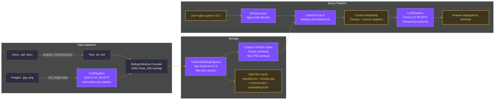
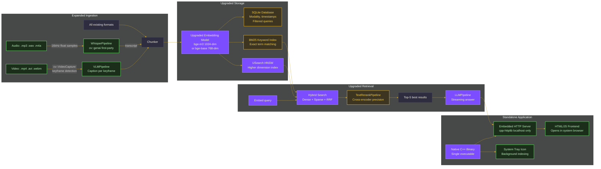
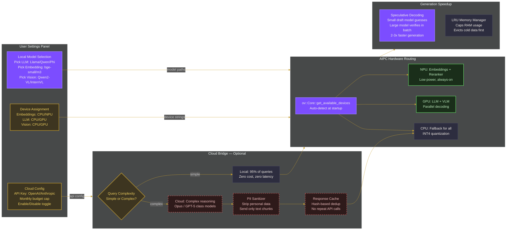

# GSoC 2026 Proposal
## OpenVINO Deep Search AI Assistant on Multimodal Personal Database for AI PC

**Student**: [Your Full Name / Lagmator22]  
**GitHub**: [@Lagmator22](https://github.com/Lagmator22)  
**Organization**: OpenVINO Toolkit  
**Mentors**: @kunda, @zhaohb, @mitruska  
**Project Duration**: 350 hours (Large, ~16 weeks)  
**Timezone**: IST (UTC+5:30)

---

## 1. Executive Summary & About Me

I propose transforming my native C++ prototype, **OvaSearch**, into a fast, hardware-agnostic multimodal RAG (Retrieval-Augmented Generation) application built on OpenVINO. The core application will run efficiently on any standard laptop (Intel CPU/GPU or Apple Silicon), with an advanced **summer stretch goal** to aggressively optimize the pipeline specifically for the memory-constrained architecture of an **Intel AI PC**.

**Key Features & Technologies:**
*   **Core Application:** A standalone, single-executable C++ application.
*   **User Interface:** Embedded `cpp-httplib` server serving a local HTML/JS web interface.
*   **Backend Orchestration:** Pure C++ OpenVINO API (`ov::Core`, `ov::genai::LLMPipeline`).
*   **Target Hardware (Core Phase):** Hardware-agnostic (Any standard laptop with CPU/GPU).
*   **Target Hardware (Summer AIPC Stretch Goal):** Intel Core Ultra AI PCs (Lunar Lake), strictly constrained to a **16GB shared LPDDR5X-8533** memory limit, explicitly targeting the NPU for embeddings to save power.
*   **Storage Index:** `sqlite-vec` (C/C++ SQLite Extension) natively storing `int8[256]` Matryoshka dimension-sliced embeddings.
*   **Retrieval:** Hybrid search (BM25 + vectors) for enhanced accuracy.
*   **Memory Management:** Robust memory management and LRU caching for efficient resource utilization.
*   **Stretch Goals:** Optional "Cloud + Client" hybrid fallback for complex queries and explicit NPU hardware routing to prove ultimate AIPC efficiency.

**My Programming Experience (Proof of C++ & Python Competency):**

- **C++ & Systems Engineering (4 Years):** 
  I specialize in building low-level systems and rapid prototyping. Within 40-day sprints, I architected two native, hardware-accelerated C++ applications from scratch:
  *   **OvaSearch (Current POC):** A multimodal RAG engine using `USearch` HNSW indexing and OpenVINO GenAI pipelines.
  *   **[Lisper](https://github.com/Lagmator22/Lisper) (Desktop Engine):** A cross-platform speech-to-text application. I manually implemented the binary `WAV/RIFF` parsing logic [[src/lisper.cpp:L31-L214]](https://github.com/Lagmator22/Lisper/blob/main/src/lisper.cpp#L31-L214) and managed multithreaded GUI concurrency using `Dear ImGui` and `SDL2`.
  *   **Open Source Contributions:** Implemented core algorithmic data structures from scratch natively in C++ (Fenwick Trees [[PR #200]](https://github.com/uptouplaksh/Open-Source-DS-Algo/pull/200)) and authored cross-platform C-library compilation scripts for `zlib` [[PR #15]](https://github.com/ffilibs/poc/pull/15).

- **Applied Machine Learning & Python Infrastructure (3 Years):**
  I rely on Python for ML pipeline orchestration and automated framework testing.
  *   **[Google Sustainability Analytics Engine](https://github.com/Lagmator22/google-sustainability-analytics):** Engineered a full-stack PCA/K-Means segmentation pipeline from research notebooks (`eda.ipynb`) to a Streamlit inference backend (`app.py`) and automated `python-pptx` report synthesis.
  *   **Automated Framework Testing:** Authored `subprocess`-based stress-test suites for OvaSearch toScrape output for memory leaks and latency metrics during C++ inference.
  *   **Infrastructural CI/CD:** Modernized open-source Python linting workflows by centralizing scattered rules into strict `.flake8` configurations [[PR #376]](https://github.com/uptouplaksh/Open-Source-DS-Algo/pull/376).

- **Web Development & UI/UX (Demonstrating GSoC Frontend Capability):**
  Because OvaSearch requires a seamless local web interface, I have actively validated my ability to build highly responsive UIs:
  *   **Ghostfolio (~8k Stars):** Successfully submitted architectural refactors to this massive TypeScript codebase, refactoring `PortfolioSummary` data interfaces [[PR #5725]](https://github.com/ghostfolio/ghostfolio/pull/5725).
  *   **Nothing Essential Hackathon (Global Top 50):** Engineered a reactive TypeScript application ("QR Identity") from scratch, implementing raw `Animated` API pulse transitions to match a strict brand aesthetic without UI libraries.

**My OpenVINO Contributions (Prerequisite Tasks & Core Familiarization):**
### 1. **[Issue #34840 (POC)](https://github.com/openvinotoolkit/openvino/issues/34840) & [PR #33633](https://github.com/openvinotoolkit/openvino/pull/33633)**: **TopK Deterministic NaN-handling** (Mentored by **@mitruska** - Under Review). While optimizing vector retrieval, I identified that NaN values caused undefined sorting behaviors. I engineered a formal Proof of Concept proposing a `v17::TopK` enum for deterministic handling, and worked closely with mentor @mitruska to codify a strict mathematical contract for NumPy-style NaN boundaries, demonstrating my ability to navigate framework-level design decisions.
2. **[PR #34841](https://github.com/openvinotoolkit/openvino/pull/34841)**: [Refactoring] Fixed common spelling typos in core components (Under Review). This served as a targeted prerequisite exercise to deeply familiarize myself with the repository structure.
3. **[PR #33667](https://github.com/openvinotoolkit/openvino/pull/33667)**: Fix GPU eltwise kernel ambiguity for unsigned int types (**2 Approvals**, Pending CI).
4. **[PR #33572](https://github.com/openvinotoolkit/openvino/pull/33572)**: Add f64 element types to interpolate operator (Under Review).
5. **[PR #34485](https://github.com/openvinotoolkit/openvino/pull/34485)**: Add support for aten::bincount in PyTorch frontend (Under Review).

---

## 2. Project Motivation & Problem Statement

Current AI workflows force users into a binary choice: 
1. **Cloud Services** (NotebookLM) that process large files beautifully but require uploading private data and paying monthly fees.
2. **Local Workarounds** (Ollama) that demand 32GB+ RAM for heavy models and rely on abstracted wrappers rather than bare-metal optimized inference.

**The AIPC Challenge:** As emphasized by mentor **@18582088138**, AI PCs give users the power to run models locally via Intel CPU/GPU/NPU, but the real engineering challenge is coping with real-world constraints: 16GB of shared RAM, active background apps, and limited thermal headroom. Anyone can make AI work with unlimited server resources. Making it work gracefully on everyday hardware natively requires strict memory management and intelligent operator routing.

---

## 3. Proof of Concept: OvaSearch (What Works Today)

I have already built a working C++ engine to validate the hardest architectural pieces. 

* Repository: [Lagmator22/OvaSearch](https://github.com/Lagmator22/OvaSearch)
* Benchmark: 100-Query Stress Test (P50 Retrieval: 6ms, zero crashes) on Apple M2 Pro CPU.

**Current Capabilities (900+ lines of C++):**
* Concurrently runs `TextEmbeddingPipeline` (bge-small), `VLMPipeline` (Qwen2-VL), and `LLMPipeline` (Llama-3).
* Integrates USearch HNSW indexing.
* Custom local caching mechanism for changed files.



---

## 4. Proposed Solution & Architecture Progression

During GSoC, the architecture will purposefully evolve from a CLI demonstration into a robust standalone application.

### Phase 1: Local Application Upgrades (Core Deliverable)
The flat-file cache will be replaced with **`sqlite-vec`**, a bleeding-edge C++ SQLite extension uniquely suited for edge AI because it allows chunked disk reads of quantized vectors, keeping RAM overhead sub-30MB for 100k chunks. To maximize this, we will transition to **Nomic-Embed-Text v1.5**, allowing us to mathematically slice Matryoshka embeddings from 768-dim down to 256-dim within the OpenVINO C++ pipeline, saving 3x the storage memory without losing cosine-similarity accuracy. We will expand modalities to include Video and Audio (`ov::genai::WhisperPipeline`). The application will be a single executable with an embedded `cpp-httplib` server running on localhost.



### Phase 2: AIPC Optimization & "Cloud+Client" Hybrid (Summer Stretch Goals)
While the core architecture works on any PC, executing inference entirely on a laptop with 16GB of shared RAM requires extreme care. During my summer vacation, I will focus on AIPC-specific routing (`ov::Core::get_available_devices`): Generation on the iGPU, and embedding dot-products firmly pinned to the low-power NPU. 

Additionally, for 5% of queries involving complex reasoning that a local ~3B model cannot handle, I propose an optional **Cloud Bridge**. Local documents will be passed through a fast native C++ `RE2` regex scrubber to anonymize PII before delegating heavy workloads externally.



**Config-Driven Modularity (The "Industry-Level" Design):**
To ensure the pipeline is an an industry-level project, everything is completely swappable via settings because OpenVINO GenAI abstracts model types cleanly:
```cpp
// Config-driven model loading — change path = change model
std::string llm_path   = config.get("llm_model",   "models/Llama-3.2-3B-INT4");
std::string embed_path = config.get("embed_model",  "models/bge-small-en-v1.5");
std::string llm_device = config.get("llm_device",   "GPU");

// Same pipeline API, entirely different hardware/model routing
ov::genai::LLMPipeline gen_pipe(llm_path, llm_device, {
    {"KV_CACHE_PRECISION", "u8"} // Optimize Ram via INT8 KV-Cache compression
});
```
USearch and SQLite handle the storage precisely because they are battle-tested, lightweight, and demand exactly zero code changes to maintain over time. Furthermore, all INT4 models will be compressed utilizing `optimum-cli` NNCF Symmetric Data-Aware Quantization (`--weight-format int4 --sym --awq --scale-estimation`) specifically tuned to map to Intel Arc Xe2 XMX engines.

---

## 5. Realistic Implementation Timeline (350 Hours)

To ensure success, I have structured the timeline to frontload the lowest-risk, hardware-agnostic C++ core features during my hectic university semester (April/May). The highly experimental optimizations (AIPC NPU targeting, Cloud bridges) are safely quarantined into my summer vacation when I have significantly more time and physical access to the target hardware.

### W1-W4: The Foundation Core (Semester Phase - High Confidence)
* **Goal**: Ship a hardware-agnostic, single-executable RAG C++ engine.
* Integrate `sqlite-vec` + USearch HNSW. 
* Run `Nomic-Embed-Text v1.5` through `TextEmbeddingPipeline` and implement the 768->256 dim Matryoshka slicing constraint natively.
* Replace the CLI with an embedded `cpp-httplib` web server displaying a local HTML/JS UI. Ensure WebSocket streaming is hooked to the LLM token generation queue.

### W5-W8: Modality Expansion (Semester to Summer Transition)
* **Goal**: Expand into video and audio seamlessly.
* Implement a **Zero-Copy Video Pipeline**. Extract frames using OpenCV `cv::Mat` and instantly construct an `ov::Tensor` via pointer injection (`ov::Tensor(type, shape, mat.data)`) to prevent shadow-copying memory.
* Integrate `ov::genai::WhisperPipeline` for 16kHz audio sampling logic purely in C++.
* **Milestone**: Core architecture processes video/audio natively on standard CPU/GPU.

### W9-W12: AIPC Exploitation (Summer Vacation - Advanced Optimization)
* **Goal**: Optimize for the restrictive 16GB AIPC environment and hardware acceleration.
* Implement an LRU execution cache that completely unloads Vision models (`CompiledModel` destruction) before loading LLMs.
* Add explicit OpenVINO hardware routing parameters (`--llm-device GPU --embed-device NPU`).
* Compress all INT4 models utilizing `optimum-cli` NNCF Symmetric Data-Aware Quantization (`--weight-format int4 --sym --awq`) tuned for Arc iGPUs.

### W13-W16: Polish, Testing, & Cloud Bridge (Summer Finalization)
* **W13-W14 (Stretch Goal / Fallback)**: The "Cloud + Client" bridge. PII Redaction using `RE2` regular expressions covering SSN/Emails/Phone formats securely scrubbing chunks before they leave the machine via `cpp-httplib` to an array of OpenVINO Model Server (OVMS) instances hosted on Intel Gaudi 3 accelerators via the Intel Tiber Developer Cloud.
* **W15**: Attempt to hook OpenVINO's natively supported EAGLE-3 speculative decoding (FastDraft on NPU) to speed up GPU decoding if the memory budget allows.
* **W16**: Cross-Platform Verification & Profiling. Deploy GitHub Actions CI/CD to verify Intel AIPC C++ compilation from the Apple M2 Pro development environment. Utilize Intel SoC Watch for final NPU vs GPU battery profiling telemetry to prove power efficiency. Clean codebase, ship executable demo, and record submission video.

---

## 6. Real-World Execution Risk & Bug Mitigation

Any proposal promising a massive C++ stack in 350 hours without acknowledging framework bugs is unrealistic. Squeezing this pipeline into 16GB shared RAM is the dominant risk. I am mitigating this by defining a strict runtime C++ memory budget map, heavily informed by active OpenVINO GitHub issues:
    | Process Layer | Technology | Execution Device | Peak Memory |
    |---|---|---|---|
    | Vector Storage | `sqlite-vec` + USearch HNSW | CPU | ~250 MB |
    | Embedding Model | Nomic-Embed-Text v1.5 | NPU | ~200 MB |
    | LLM Decoded | Qwen2.5-3B-int4 | GPU | ~1.8 GB + KV Cache |
    | LRU Vision Model | MiniCPM-V (Loaded only during extraction) | GPU (Shared OS Pool) | ~2.0 GB |
    | **TOTAL RUNTIME PEAK** | **Hard-Capped** | **Distributed** | **~5.5 GB** |

**How I will survive the 350-Hour Timeline:**
1. **Semester vs Summer Risk Loading**: The biggest risk to academic projects is the collision with university exams. I have mitigated this by completely detaching the AIPC and Cloud functionality from the core Phase 1 deliverables. The baseline C++ integration (`sqlite-vec`, Hybrid Search, Web UI) will be completed early natively on my Apple M2 Pro development environment. The experimental NPU and Gaudi 3 Cloud features will be explored strictly during the summer.
2. **The OpenVINO Memory Leak (Issue #31383)**: OpenVINO has an unfixed memory leak when repeatedly loading/destroying `ov::CompiledModel`. **Mitigation:** If standard C++ destruction fails to release active glibc memory under the 16GB AIPC limit, I will implement Process-Level Isolation, executing the VLM in a child process that is explicitly killed by the OS.
3. **Zero-Copy "Shadow Copy" Traps**: Passing unaligned `cv::Mat` data to `ov::Tensor` on NPU/GPU triggers silent memory duplication. **Mitigation:** I will strictly enforce 4096-byte page alignment on all OpenCV ingestion buffers and use RAII to guarantee memory lifetimes natively.

---

## 7. Communication Plan & Post-GSoC Commitment

* **GSoC Cadence**: 35-40 hours per week exclusively on this project. Nightly branch pushes and weekly architecture check-ins documenting real-world memory bounds vs output latency.
* **Post-GSoC**: I deeply value the mentor interactions I've had over my past 4 PRs. I intend to maintain OvaSearch as an ongoing open-source benchmark application for OpenVINO GenAI, keeping it aligned with framework updates.

---

## 8. General Questions

**Why should we pick you?**

You don't need to guess if I can execute this proposal; you can already compile and run my 100-query stress-tested C++ backend. I am already an active contributor to OpenVINO’s core architecture. Beyond demonstrating rapid execution speed by architecting complex C++ applications like **OvaSearch** and **Lisper** from scratch, I recently engineered a native C++ Proof-of-Concept to resolve undefined `NaN` sorting vulnerabilities within the OpenVINO `TopK` operator (Issue #34840). By utilizing template metaprogramming and custom `std::nth_element` comparators to introduce backward-compatible `NaNMode` handling, I demonstrated an ability to navigate deep framework-level design decisions. Combined with my proven track record of shipping highly-polished web interfaces (Ghostfolio, Top-50 Global "Nothing" App Hackathon), I possess the exact intersection of low-level systems engineering, AI inference experience, and frontend speed required to successfully deliver this multimodal AIPC assistant. I understand exactly what it takes to abstract memory, route workloads across silicon boundaries, and provide fallback solutions to optimize the end-user experience above all else.
```
